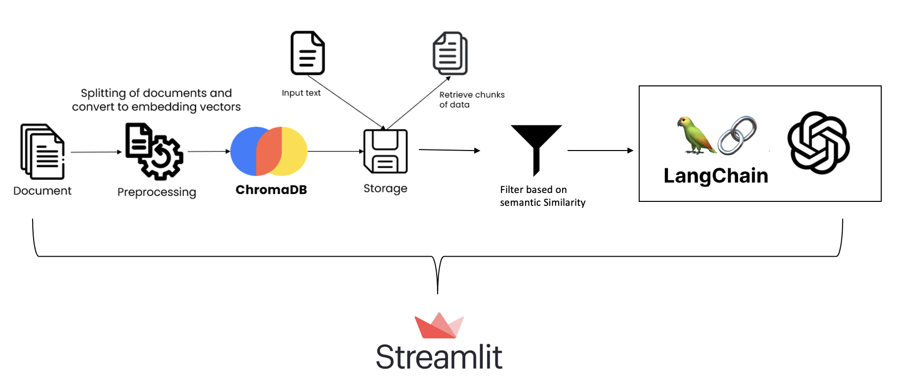
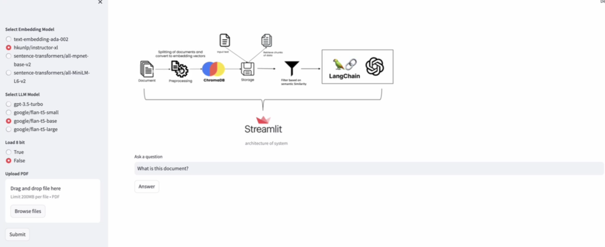

# PDF Question Answering Application

## Introduction
This project presents a PDF Question Answering application using advanced NLP models and embeddings to extract and answer questions from PDF document content.

## Project Design 
- Text extraction and processing from PDF documents.

- Streamlit-based web interface for user interaction and querying.

## Context Control implementation
In addition to the core functionalities, this project implements an advanced context control mechanism for Language Large Models (LLMs) using a threshold based on Sentence Transformers. This feature enhances the relevance and accuracy of responses by ensuring that the LLMs only process and respond to contextually appropriate content. To achieve this, a semantic similarity threshold is calculated, beyond which the LLM is engaged for generating responses. This method is critical in filtering out irrelevant content and focusing on the most pertinent information within the documents. Furthermore, the project also explored other sophisticated methods for text processing and feature extraction, such as autoencoders and BERT (Bidirectional Encoder Representations from Transformers)for sentence similarity measurement. 

## Embeddings and Language Models Used

### Embeddings
- OpenAI's Ada: `text-embedding-ada-002`
- Instructor-XL: `hkunlp/instructor-xl`
- SBERT's MPNet base: `sentence-transformers/all-mpnet-base-v2`
- SBERT's MiniLM: `sentence-transformers/all-MiniLM-L6-v2`

### Language Models (LLMs)
- OpenAI GPT-3.5: `gpt-3.5-turbo`
- FLAN T5 XXL: `google/flan-t5-xxl`
- FLAN T5 XL: `google/flan-t5-xl`
- FLAN T5 Small: `google/flan-t5-small`
- FLAN T5 Base: `google/flan-t5-base`
- FLAN T5 Large: `google/flan-t5-large`
- Go Bruins: `rwitz/go-bruins-v2`
- FastChat T5 XL: `lmsys/fastchat-t5-3b-v1.0`
- Falcon Small: `tiiuae/falcon-7b-instruct`

## Technologies Used
- Python
- Streamlit for the web interface
- LangChain for document processing
- Transformers and Sentence Transformers for NLP tasks
- PyTorch for machine learning computations
